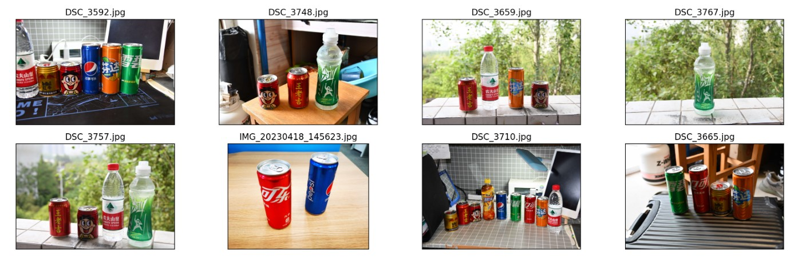
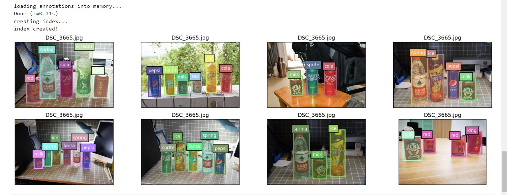
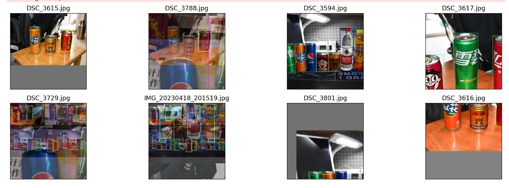
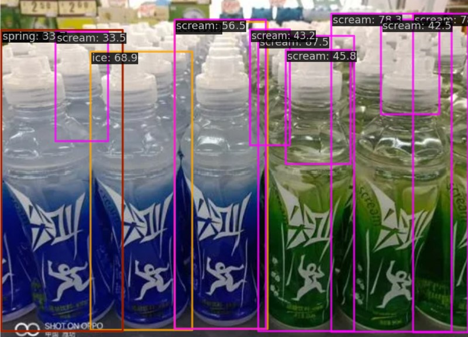

## 环境安装

详见笔记: [【7班】MMDetection 代码课](https://bbs.csdn.net/topics/615863192)

## 完成步骤

### 饮料数据集下载

[饮料数据集](https://github.com/TommyZihao/Train_Custom_Dataset/tree/main/%E7%9B%AE%E6%A0%87%E6%A3%80%E6%B5%8B/%E7%9B%AE%E6%A0%87%E6%A3%80%E6%B5%8B%E6%95%B0%E6%8D%AE%E9%9B%86)

```bash
cd data/
wget https://zihao-download.obs.cn-east-3.myhuaweicloud.com/yolov8/datasets/Drink_284_Detection_Dataset/Drink_284_Detection_coco.zip
unzip Drink_284_Detection_coco.zip -d Drink_284_Detection_coco && rm Drink_284_Detection_coco.zip
```

### 数据集和标签可视化

数据集可视化：

```python
# 数据集可视化

import os
import matplotlib.pyplot as plt
from PIL import Image

%matplotlib inline
%config InlineBackend.figure_format = 'retina'

original_images = []
images = []
texts = []
plt.figure(figsize=(16, 5))

image_paths= [filename for filename in os.listdir('data/Drink_284_Detection_coco/Drink_284_Detection_coco/images')][:8]

for i,filename in enumerate(image_paths):
    name = os.path.splitext(filename)[0]

    image = Image.open('data/Drink_284_Detection_coco/Drink_284_Detection_coco/images/'+filename).convert("RGB")
  
    plt.subplot(2, 4, i+1)
    plt.imshow(image)
    plt.title(f"{filename}")
    plt.xticks([])
    plt.yticks([])

plt.tight_layout()
```



标签可视化：

```python
from pycocotools.coco import COCO
import numpy as np
import os.path as osp
from matplotlib.collections import PatchCollection
from matplotlib.patches import Polygon

def apply_exif_orientation(image):
    _EXIF_ORIENT = 274
    if not hasattr(image, 'getexif'):
        return image

    try:
        exif = image.getexif()
    except Exception:
        exif = None

    if exif is None:
        return image

    orientation = exif.get(_EXIF_ORIENT)

    method = {
        2: Image.FLIP_LEFT_RIGHT,
        3: Image.ROTATE_180,
        4: Image.FLIP_TOP_BOTTOM,
        5: Image.TRANSPOSE,
        6: Image.ROTATE_270,
        7: Image.TRANSVERSE,
        8: Image.ROTATE_90,
    }.get(orientation)
    if method is not None:
        return image.transpose(method)
    return image


def show_bbox_only(coco, anns, show_label_bbox=True, is_filling=True):
    """Show bounding box of annotations Only."""
    if len(anns) == 0:
        return

    ax = plt.gca()
    ax.set_autoscale_on(False)

    image2color = dict()
    for cat in coco.getCatIds():
        image2color[cat] = (np.random.random((1, 3)) * 0.7 + 0.3).tolist()[0]

    polygons = []
    colors = []

    for ann in anns:
        color = image2color[ann['category_id']]
        bbox_x, bbox_y, bbox_w, bbox_h = ann['bbox']
        poly = [[bbox_x, bbox_y], [bbox_x, bbox_y + bbox_h],
                [bbox_x + bbox_w, bbox_y + bbox_h], [bbox_x + bbox_w, bbox_y]]
        polygons.append(Polygon(np.array(poly).reshape((4, 2))))
        colors.append(color)

        if show_label_bbox:
            label_bbox = dict(facecolor=color)
        else:
            label_bbox = None

        ax.text(
            bbox_x,
            bbox_y,
            '%s' % (coco.loadCats(ann['category_id'])[0]['name']),
            color='white',
            bbox=label_bbox)

    if is_filling:
        p = PatchCollection(
            polygons, facecolor=colors, linewidths=0, alpha=0.4)
        ax.add_collection(p)
    p = PatchCollection(
        polygons, facecolor='none', edgecolors=colors, linewidths=2)
    ax.add_collection(p)


coco = COCO('data/Drink_284_Detection_coco/Drink_284_Detection_coco/train_coco.json')
image_ids = coco.getImgIds()
np.random.shuffle(image_ids)

plt.figure(figsize=(16, 5))

# 只可视化 8 张图片
for i in range(8):
    image_data = coco.loadImgs(image_ids[i])[0]
    image_path = osp.join('data/Drink_284_Detection_coco/Drink_284_Detection_coco/images/',image_data['file_name'])
    annotation_ids = coco.getAnnIds(
            imgIds=image_data['id'], catIds=[], iscrowd=0)
    annotations = coco.loadAnns(annotation_ids)
    
    ax = plt.subplot(2, 4, i+1)
    image = Image.open(image_path).convert("RGB")
    
    # 这行代码很关键，否则可能图片和标签对不上
    image=apply_exif_orientation(image)
    
    ax.imshow(image)
    
    show_bbox_only(coco, annotations)
    
    plt.title(f"{filename}")
    plt.xticks([])
    plt.yticks([])
        
plt.tight_layout()
```




数据流可视化：

```python
from mmdet.registry import DATASETS, VISUALIZERS
from mmengine.config import Config
from mmengine.registry import init_default_scope
import matplotlib.pyplot as plt
import os.path as osp

%matplotlib inline

cfg = Config.fromfile('config/rtm-det_100e.py')

init_default_scope(cfg.get('default_scope', 'mmdet'))

dataset = DATASETS.build(cfg.train_dataloader.dataset)
visualizer = VISUALIZERS.build(cfg.visualizer)
visualizer.dataset_meta = dataset.metainfo

plt.figure(figsize=(16, 5))

# 只可视化前 8 张图片
for i in range(8):
   item=dataset[i]

   img = item['inputs'].permute(1, 2, 0).numpy()
   data_sample = item['data_samples'].numpy()
   gt_instances = data_sample.gt_instances
   img_path = osp.basename(item['data_samples'].img_path)

   gt_bboxes = gt_instances.get('bboxes', None)
   gt_instances.bboxes = gt_bboxes.tensor
   data_sample.gt_instances = gt_instances

   visualizer.add_datasample(
            osp.basename(img_path),
            img,
            data_sample,
            draw_pred=False,
            show=False)
   drawed_image=visualizer.get_image()

   plt.subplot(2, 4, i+1)
   plt.imshow(drawed_image[..., [2, 1, 0]])
   plt.title(f"{osp.basename(img_path)}")
   plt.xticks([])
   plt.yticks([])

plt.tight_layout()  
```



### 配置文件

```python

_base_ = ['../_base_/rtmdet_tiny_8xb32-300e_coco.py']

data_root = 'data/Drink_284_Detection_coco/Drink_284_Detection_coco/'

# 非常重要
metainfo = {
    'classes': ("cola","pepsi","sprite","fanta","spring", 
                "ice", "scream","milk","red","king"),
    'palette': [
        (101, 205, 228),(240, 128, 128), (154, 205, 50), (34, 139, 34), 
        (139, 0, 0), (255, 165, 0), (255, 0, 255), (255, 255, 0), 
        (29, 123, 243), (0, 255, 255), 
    ]
}
num_classes = 10

# 训练 100 epoch
max_epochs = 100
# 训练单卡 bs= 12
train_batch_size_per_gpu = 64
# 可以根据自己的电脑修改
train_num_workers = 4

# 验证集 batch size 为 1
val_batch_size_per_gpu = 32
val_num_workers = 4

# RTMDet 训练过程分成 2 个 stage，第二个 stage 会切换数据增强 pipeline
num_epochs_stage2 = 12

# batch 改变了，学习率也要跟着改变， 0.004 是 8卡x32 的学习率
base_lr = 64 * 0.004 / (32*8)

# 采用 COCO 预训练权重
load_from = 'checkpoint/rtmdet_tiny_8xb32-300e_coco_20220902_112414-78e30dcc.pth'  # noqa

model = dict(
    # 考虑到数据集太小，且训练时间很短，我们把 backbone 完全固定
    # 用户自己的数据集可能需要解冻 backbone
    backbone=dict(
        frozen_stages=4, 
        init_cfg=dict(
            type='Pretrained', prefix='backbone.', checkpoint='checkpoint/cspnext-tiny_imagenet_600e.pth')),
    # 不要忘记修改 num_classes
    bbox_head=dict(dict(num_classes=num_classes)))

# 数据集不同，dataset 输入参数也不一样
train_dataloader = dict(
    batch_size=train_batch_size_per_gpu,
    num_workers=train_num_workers,
    pin_memory=False,
    dataset=dict(
        data_root=data_root,
        metainfo=metainfo,
        ann_file='train_coco.json',
        data_prefix=dict(img='images/')))

val_dataloader = dict(
    batch_size=val_batch_size_per_gpu,
    num_workers=val_num_workers,
    dataset=dict(
        metainfo=metainfo,
        data_root=data_root,
        ann_file='val_coco.json',
        data_prefix=dict(img='images/')))

test_dataloader = val_dataloader

# 默认的学习率调度器是 warmup 1000，但是 cat 数据集太小了，需要修改 为 30 iter
param_scheduler = [
    dict(
        type='LinearLR',
        start_factor=1.0e-5,
        by_epoch=False,
        begin=0,
        end=50),
    dict(
        type='CosineAnnealingLR',
        eta_min=base_lr * 0.05,
        begin=max_epochs // 2,  # max_epoch 也改变了
        end=max_epochs,
        T_max=max_epochs // 2,
        by_epoch=True,
        convert_to_iter_based=True),
]
optim_wrapper = dict(optimizer=dict(lr=base_lr))

# 第二 stage 切换 pipeline 的 epoch 时刻也改变了
_base_.custom_hooks[1].switch_epoch = max_epochs - num_epochs_stage2

val_evaluator = dict(ann_file=data_root + 'val_coco.json')
test_evaluator = val_evaluator

# 一些打印设置修改
default_hooks = dict(
    checkpoint=dict(interval=5, max_keep_ckpts=2, save_best='auto'),  # 同时保存最好性能权重
    logger=dict(type='LoggerHook', interval=5))
train_cfg = dict(max_epochs=max_epochs, val_interval=1)
```

**指标：**

```bash
Running per image evaluation...
Evaluate annotation type *bbox*
DONE (t=0.33s).
Accumulating evaluation results...
DONE (t=0.11s).
 Average Precision  (AP) @[ IoU=0.50:0.95 | area=   all | maxDets=100 ] = 0.968
 Average Precision  (AP) @[ IoU=0.50      | area=   all | maxDets=100 ] = 0.993
 Average Precision  (AP) @[ IoU=0.75      | area=   all | maxDets=100 ] = 0.993
 Average Precision  (AP) @[ IoU=0.50:0.95 | area= small | maxDets=100 ] = -1.000
 Average Precision  (AP) @[ IoU=0.50:0.95 | area=medium | maxDets=100 ] = -1.000
 Average Precision  (AP) @[ IoU=0.50:0.95 | area= large | maxDets=100 ] = 0.968
 Average Recall     (AR) @[ IoU=0.50:0.95 | area=   all | maxDets=  1 ] = 0.949
 Average Recall     (AR) @[ IoU=0.50:0.95 | area=   all | maxDets= 10 ] = 0.978
 Average Recall     (AR) @[ IoU=0.50:0.95 | area=   all | maxDets=100 ] = 0.978
 Average Recall     (AR) @[ IoU=0.50:0.95 | area= small | maxDets=100 ] = -1.000
 Average Recall     (AR) @[ IoU=0.50:0.95 | area=medium | maxDets=100 ] = -1.000
 Average Recall     (AR) @[ IoU=0.50:0.95 | area= large | maxDets=100 ] = 0.978
06/12 16:42:14 - mmengine - INFO - bbox_mAP_copypaste: 0.968 0.993 0.993 -1.000 -1.000 0.968
06/12 16:42:14 - mmengine - INFO - Epoch(val) [96][2/2]  coco/bbox_mAP: 0.9680  coco/bbox_mAP_50: 0.9930  coco/bbox_mAP_75: 0.9930  coco/bbox_mAP_s: -1.0000  coco/bbox_mAP_m: -1.0000  coco/bbox_mAP_l: 0.9680  data_time: 2.4507  time: 2.8691
06/12 16:42:14 - mmengine - INFO - The previous best checkpoint /data/run01/scz0brk/openmmlab/homework-3/work_dirs/rtm-det_100e/best_coco/bbox_mAP_epoch_83.pth is removed
06/12 16:42:15 - mmengine - INFO - The best checkpoint with 0.9680 coco/bbox_mAP at 96 epoch is saved to best_coco/bbox_mAP_epoch_96.pth.
06/12 16:42:27 - mmengine - INFO - Exp name: rtm-det_100e_20230612_155919
06/12 16:42:33 - mmengine - INFO - Evaluating bbox...
```

### 预测

**单张图片预测**：

```python
# test a single image

from mmdet.apis import init_detector, inference_detector
from mmdet.utils import register_all_modules
from mmdet.registry import VISUALIZERS
import mmcv

config_file = './config/rtm-det_100e.py'
checkpoint_file = './work_dirs/rtm-det_100e/best_coco/bbox_mAP_epoch_96.pth'

register_all_modules()

model = init_detector(config_file, checkpoint_file, device='cpu')  # or device='cuda:0'

img = mmcv.imread( './test/jianjiao.jpg', channel_order='rgb')
result = inference_detector(model, img)
print(result)

# show the results
visualizer.add_datasample(
    'result',
    img,
    data_sample=result,
    draw_gt=False,
    wait_time=0,
)
visualizer.show()
```



**文件夹预测**：

```bash
python tools/image_demo.py test/ \
        ./config/rtm-det_100e.py \
        --weights ./work_dirs/rtm-det_100e/best_coco/bbox_mAP_epoch_96.pth \
        --out-dir outputs/ \
        --device cpu \
        --pred-score-thr 0.3 \
        --batch-size 1 \
        --show \
        --print-result
```

**结果：** [output](output/)

### 可视化

在此之前记得安装 mmyolo，这个库是基于 mmdetection 开发的，可以可视化 mmdetection 的模型。除此之外也要记得安装 grad-cam 。


```bash
python tools/featmap_vis_demo.py test/ config/rtm-det_100e.py work_dirs/rtm-det_100e/best_coco/bbox_mAP_epoch_96.pth --out-dir output-vis/backbone/ --target-layers backbone --channel-reduction squeeze_mean &
python tools/featmap_vis_demo.py test/ config/rtm-det_100e.py work_dirs/rtm-det_100e/best_coco/bbox_mAP_epoch_96.pth --out-dir output-vis/neck/ --target-layers neck --channel-reduction squeeze_mean &
python tools/boxam_vis_demo.py test/ config/rtmdet_100e.py work_dirs/rtm-det_100e/best_coco/bbox_mAP_epoch_96.pth --out-dir output-vis/grad-cam/neck-2/ --target-layer neck.out_convs[2] &
python tools/boxam_vis_demo.py test/ config/rtmdet_100e.py work_dirs/rtm-det_100e/best_coco/bbox_mAP_epoch_96.pth --out-dir output-vis/grad-cam/neck-0/ --target-layer neck.out_convs[0] 
```

**结果**

[output-vis](output-vis/)


**注意**：

`boxam_vis_demo.py` 运行的日志文件要记得按照以下命名规则进行开头，否则会有不可名状的错误：

```python
IGNORE_LOSS_PARAMS = {
    'yolov5': ['loss_obj'],
    'yolov6': ['loss_cls'],
    'yolox': ['loss_obj'],
    'rtmdet': ['loss_cls'],
    'yolov7': ['loss_obj'],
    'yolov8': ['loss_cls'],
    'ppyoloe': ['loss_cls'],
}
```


